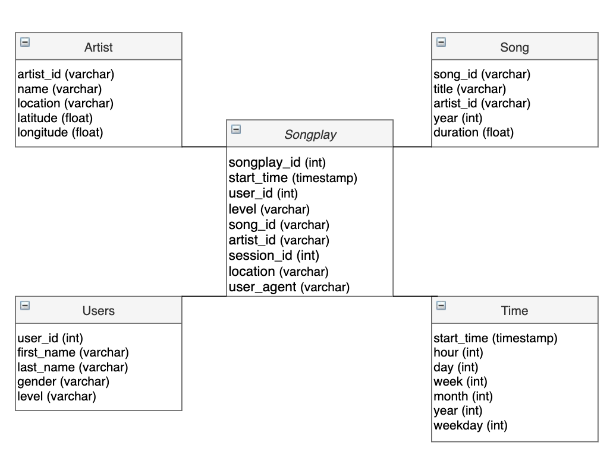

# Data Modeling with Postgres

# Introduction Scenario 

A startup called Sparkify wants to analyze the data they've been collecting on songs and user activity on their new music streaming app. The analytics team is particularly interested in understanding what songs users are listening to. Currently, they don't have an easy way to query their data, which resides in a directory of JSON logs on user activity on the app, as well as a directory with JSON metadata on the songs in their app.

They'd like a data engineer to create a Postgres database with tables designed to optimize queries on song play analysis, and bring you on the project. Your role is to create a database schema and ETL pipeline for this analysis. You'll be able to test your database and ETL pipeline by running queries given to you by the analytics team from Sparkify and compare your results with their expected results.

# Project Datasets
[Million Song Dataset](https://labrosa.ee.columbia.edu/millionsong/): real data containing metadata about a song and it's respective artist. JSON files are partitioned into separate directories by the first three letters of the song's track ID.

[Event simulator](https://github.com/Interana/eventsim): User actvitiy log files based on songs in the dataset above. JSON files are partitioned by year and month.

## Song Dataset
The first dataset is a subset of real data from the Million Song Dataset. Each file is in JSON format and contains metadata about a song and the artist of that song. The files are partitioned by the first three letters of each song's track ID. For example, here are filepaths to two files in this dataset.

song_data/A/B/C/TRABCEI128F424C983.json
song_data/A/A/B/TRAABJL12903CDCF1A.json
And below is an example of what a single song file, TRAABJL12903CDCF1A.json, looks like.

{"num_songs": 1, "artist_id": "ARJIE2Y1187B994AB7", "artist_latitude": null, "artist_longitude": null, "artist_location": "", "artist_name": "Line Renaud", "song_id": "SOUPIRU12A6D4FA1E1", "title": "Der Kleine Dompfaff", "duration": 152.92036, "year": 0}

## Log Dataset
The second dataset consists of log files in JSON format generated by this event simulator based on the songs in the dataset above. These simulate activity logs from a music streaming app based on specified configurations.

The log files in the dataset you'll be working with are partitioned by year and month. For example, here are filepaths to two files in this dataset.

log_data/2018/11/2018-11-12-events.json
log_data/2018/11/2018-11-13-events.json

# Project Description

In this project, I applied what I've learned on data modeling with Postgres and build an ETL pipeline using Python. I created fact and dimension tables that follow a star schema structure for a particular analytic focus. The ETL pipeline transfers data from files in two local directories into these tables in Postgres using Python and SQL.

# Star Schema:

Database Diagram using [draw.io](draw.io)

# Repository Files
- create_tables.py - Initiates sparkify database and tables

- sql_queries.py - SQL queries imported into create_table.py and etl.py and etl.ipynb

- test.ipynb - Test file to see if data was loaded properly

- etl.ipynb - Notebook used to create and experiment with ETL pipeline 

- etl.py - Main ETL pipeline file 

# ETL Pipeline

## Song Files

- Get json filepath using get_files function

- Read json file into pandas dataframe

- Transform dataframe's array values into a list

- Insert list into appropriate database table using psycopg2 (PostgreSQL Python wrapper)

## Log Files

- Get json filepath using get_files function

- Read json file into pandas dataframe

- Separate time and user columns from the dataframe into separate dataframes

- Transform dataframes' array values into separate  list

- Insert lists into appropriate database table using psycopg2 (PostgreSQL Python wrapper)

- For the songplay table, the psycopg2 SQL query joins artists and songs tables on artist_id and inserts necessary columns from artist and songs table. The necessary columns from the log dataframe are also inserted within the same query. 
